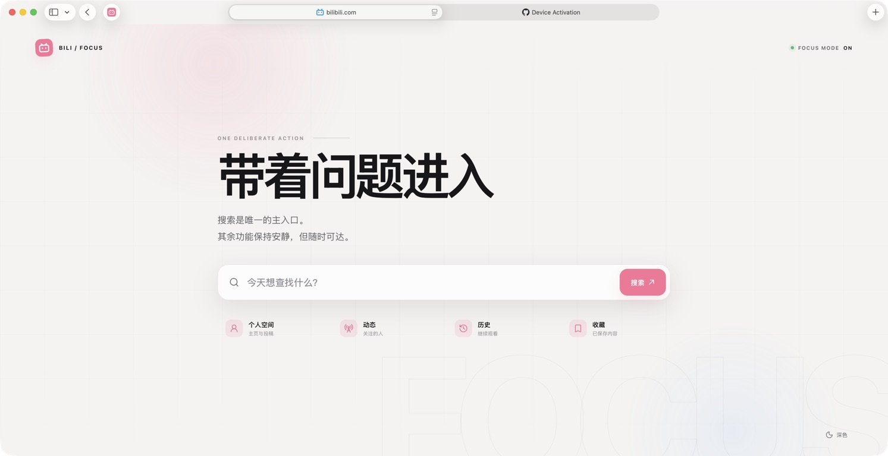

# Bili Focus

一个为 Safari 制作的极简 Bilibili 首页扩展。

打开 Bilibili 时，只保留搜索、个人空间、动态、历史和收藏，减少推荐信息流带来的注意力消耗。



## 功能

- 将 `https://www.bilibili.com/` 替换为专注首页
- 地址栏始终保留 Bilibili 原始网址
- 在原首页渲染前接管页面，避免推荐信息流闪现
- 提供搜索、个人空间、动态、历史和收藏入口
- 支持浅色与深色模式
- 只影响 Bilibili 首页，不修改视频页、搜索页等其他页面
- 不收集数据，不包含统计、广告或远程脚本

## 安装

### 1. 准备环境

- macOS 13 或更高版本
- Safari
- Xcode

### 2. 打开工程

用 Xcode 打开：

```text
BiliFocusXcode/Bili Focus/Bili Focus.xcodeproj
```

### 3. 配置签名

在 Xcode 中分别选择以下两个 Target：

- `Bili Focus`
- `Bili Focus Extension`

进入 `Signing & Capabilities`，勾选 `Automatically manage signing`，并为两个 Target 选择同一个 Apple Team。

如果 Bundle Identifier 与本机已有项目冲突，可将 `local.amormz.bilifocus` 修改为自己的唯一标识。

### 4. 运行并启用

1. Scheme 选择 `Bili Focus`
2. Destination 选择 `My Mac`
3. 点击运行
4. 打开 `Safari → 设置 → 扩展`
5. 勾选 `Bili Focus`
6. 允许扩展访问 `bilibili.com`

重新打开 `https://www.bilibili.com/` 即可。

## 工作原理

扩展仅匹配 Bilibili 根首页，并在 `document_start` 阶段运行：

1. 先阻止推荐信息流和页面脚本继续加载
2. 加载扩展内置的专注首页资源
3. 在当前文档内替换页面内容，不进行网址重定向
4. 如果资源加载失败，显示可恢复的错误页，避免无提示白屏

因此地址栏仍然是 `bilibili.com`，登录状态和其他 Bilibili 页面也不会受到影响。

## 项目结构

```text
.
├── BiliFocusXcode/      # 可直接运行的 macOS Safari Extension 工程
├── safari-extension/   # Web Extension 原始资源
├── docs/               # README 效果图
└── README.md
```

修改 `safari-extension/` 中的资源后，需要同步到：

```text
BiliFocusXcode/Bili Focus/Bili Focus Extension/Resources/
```

## 隐私

Bili Focus 不上传浏览记录、搜索词或账号信息。主题偏好仅保存在浏览器的扩展本地存储中。

## 声明

本项目是非官方的个人开源工具，与哔哩哔哩（Bilibili）无隶属或合作关系。Bilibili 名称与图标归其权利人所有。

## License

[MIT](LICENSE)
